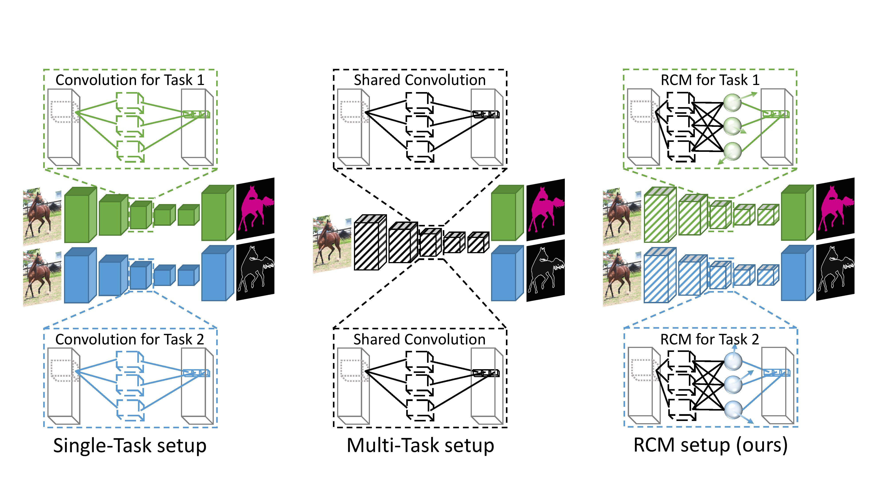
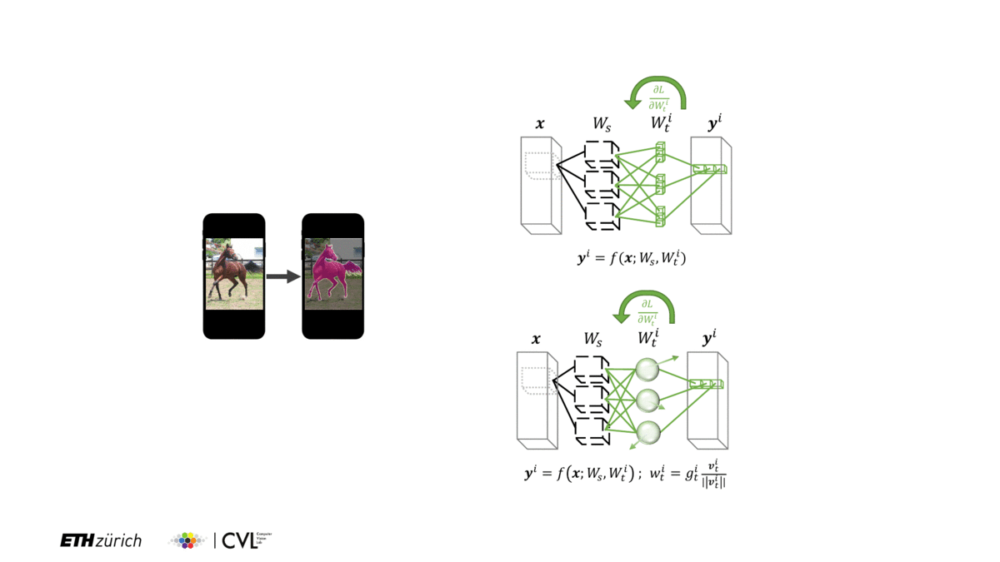

# Reparameterizing Convolutions for Incremental Multi-Task Learning without Task Interference

This is the official repository (in PyTorch) for the ECCV 2020 paper [Reparameterizing Convolutions for Incremental Multi-Task Learning without Task Interference](https://arxiv.org/pdf/2007.12540.pdf).

<p align="center">

</p>

## Abstract

Multi-task networks are commonly utilized to alleviate the
need for a large number of highly specialized single-task networks. However, two common challenges in developing multi-task models are often
overlooked in literature. First, enabling the model to be inherently incremental, continuously incorporating information from new tasks without
forgetting the previously learned ones (incremental learning). Second,
eliminating adverse interactions amongst tasks, which has been shown to
significantly degrade the single-task performance in a multi-task setup
(task interference). In this paper, we show that both can be achieved
simply by reparameterizing the convolutions of standard neural network
architectures into a non-trainable shared part (filter bank) and tasks-pecific parts (modulators), where each modulator has a fraction of the
filter bank parameters. Thus, our reparameterization enables the model
to learn new tasks without adversely affecting the performance of existing
ones. The results of our ablation study attest the efficacy of the proposed
reparameterization. Moreover, our method achieves state-of-the-art on
two challenging multi-task learning benchmarks, PASCAL-Context and
NYUD, and also demonstrates superior incremental learning capability
as compared to its close competitors.

<p align="center">

</p>

## Installation / Setup

This codebase makes use of Docker for easy reproducibility.

### Clone the repository
```
git clone https://github.com/menelaoskanakis/RCM.git
```

### Build Dockerfile
```
cd RCM
docker build -t rcm:latest .
```

### Start docker container

Setup as follows:
```
NV_GPU=0 nvidia-docker run -it --rm --ipc=host -v /path/to/RCM/directory/:/RCM/ -v /path/to/datasets/:/RCM/data/ -v /path/to/results/:/RCM/results/ -v /path/to/RI/:/RCM/RI/ -v /path/to/models/:/RCM/models rcm:latest
```

Example setup:
```
NV_GPU=0 nvidia-docker run -it --rm --ipc=host -v /home/menelaos/dev/RCM/:/RCM/ -v /raid/menelaos/RCM/datasets:/RCM/data/ -v /raid/menelaos/RCM/results/:/RCM/results/ -v /raid/menelaos/RCM/RI/:/RCM/RI/ -v /raid/menelaos/RCM/models/:/RCM/models rcm:latest
```

Note:
The -v flag mounts the directory (on the left of :) into the container (on the right of :)

RCM directory inside container looks like this:

```
RCM
├── Already existing directories (i.e. configs, augmentations etc)
├── data (subdirectories are downloaded automatically depending on the experiment needs)
│   ├── NYUD_MT
│   ├── PASCAL_MT
│   └── mini_val_imagenet
├── results     
│   ├── NYUD
│   └── PascalContext
├── RI (download manually if "RI" is needed. Link below.)     
│   └── resnet18
└── models (download manually if RC or RA models are needed. Link below.)
```

[Download RI (RI subdirectory)](https://data.vision.ee.ethz.ch/kanakism/RI.zip)

[Download pretrained resnet18 models (models subdirectory)](https://data.vision.ee.ethz.ch/kanakism/pretrained_models.zip)

[Download sample results for the provided configs (results subdirectory)](https://data.vision.ee.ethz.ch/kanakism/results.zip)

### Code usage (from ```/RCM``` directory in the docker container)

#### Train model
```
python train.py --gpu_id 0 --config ./configs/PascalContext/semseg_RC_RI_NFF.yaml
```
#### Test model
```
python test.py --gpu_id 0 --config ./configs/PascalContext/semseg_RC_RI_NFF.yaml --log_performance ./results/PascalContext/performance.csv
```

All evaluation scripts are run automatically apart for boundary detection. 
For that you need to use the MATLAB-based repo of [seism](https://github.com/jponttuset/seism).
The test.py script generates the predictions and using the provided './evaluation/evaluation_edge.py' script
you can send the predictions for evaluation by the [seism](https://github.com/jponttuset/seism) repo.


#### Response Initialization (RI) 
Required information for RI have been pre-computed and can be downloaded [here](https://data.vision.ee.ethz.ch/kanakism/RI.zip), but the subspace can also be generated using:
```
python ./decomp/main.py -a resnet18 --activation_root ./RI ./data
python ./decomp/activation_decomposition.py --root ./RI/resnet18/
```

#### For Tensorboard use

Setup as follows:
```
nvidia-docker run -p ####:#### -it --rm --ipc=host -v /path/to/RCM/directory/:/RCM/ -v /path/to/datasets/:/RCM/data/ -v /path/to/results/:/RCM/results/ -v /path/to/RI/:/RCM/RI/ -v /path/to/models/:/RCM/models rcm:latest
```
where '####' represents the port number e.g. 6006

then in the ```/RCM``` directory
```
tensorboard --logdir ./results --port ####
```
If you are using port forwarding to your local machine, access through `localhost:####`.

## Citation

If you use this code, please consider citing the following paper:

```
@article{kanakis2020reparameterizing,
  title={Reparameterizing Convolutions for Incremental Multi-Task Learning without Task Interference},
  author={Kanakis, Menelaos and Bruggemann, David and Saha, Suman and Georgoulis, Stamatios and Obukhov, Anton and Van Gool, Luc},
  journal={arXiv preprint arXiv:2007.12540},
  year={2020}
}
```